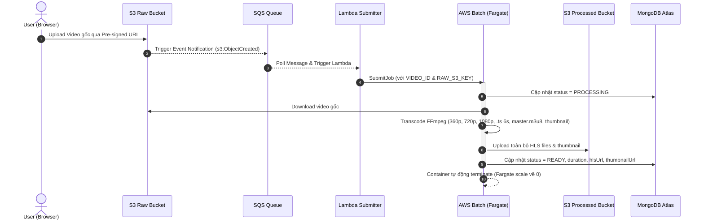
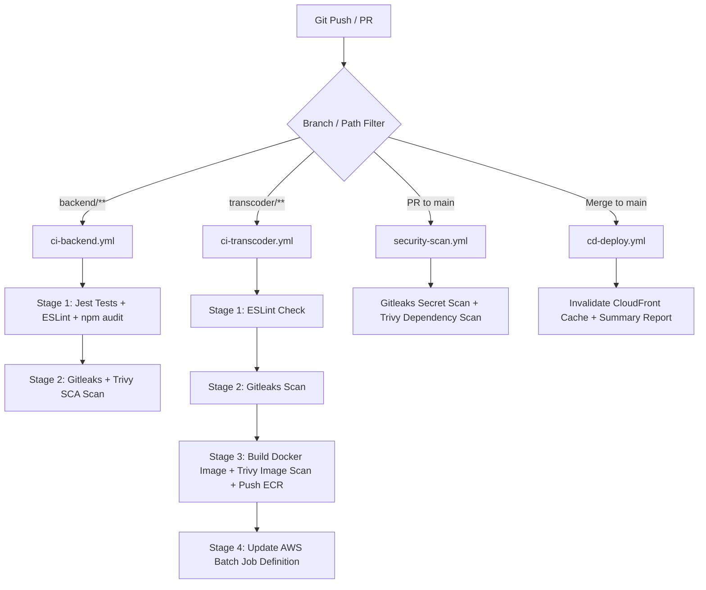

# 🎬 Xây dựng Nền tảng Chia sẻ Video Trực tuyến với Hệ thống Chuyển mã HLS Tự động trên Kiến trúc Serverless Container và Event-Driven
## Building a Video Sharing Platform with Automated HLS Transcoding Pipeline on Serverless Container and Event-Driven Architecture

> **Môn học:** Dự án Công nghệ Thông tin (DACNTT)  
> **Sinh viên thực hiện:**
> - Đinh Quốc Cường (MSSV: 523H0008)
> - Võ Huỳnh Minh Đức (MSSV: 523H0014)
>
> **Giảng viên hướng dẫn:** Thầy ThS. Mai Văn Mạnh  
> **Định hướng chuyên sâu:** DEVOPS, CONTAINERIZATION & CLOUD SYSTEMS  
> **GitHub Repository:** [https://github.com/DinhQuocCuong28664/CUOC_SONG_MOI](https://github.com/DinhQuocCuong28664/CUOC_SONG_MOI)  
> **Tên miền ứng dụng (Production Domain):** [https://zelostech.site](https://zelostech.site)

---

## 📋 MỤC LỤC TỔNG QUAN

1. [Tên đề tài](#1-tên-đề-tài)
2. [Thông tin thực hiện](#2-thông-tin-thực-hiện)
3. [Bối cảnh và vấn đề](#3-bối-cảnh-và-vấn-đề)
4. [Mục tiêu của đề tài](#4-mục-tiêu-của-đề-tài)
5. [Các chức năng chính](#5-các-chức-năng-chính)
6. [Quy trình chuyển mã video (Transcoding Pipeline)](#6-quy-trình-chuyển-mã-video)
7. [Phân phối nội dung video (CDN & OAC)](#7-phân-phối-nội-dung-video)
8. [Hạ tầng Cloud-Native và Containerization](#8-hạ-tầng-cloud-native-và-containerization)
9. [CI/CD Pipeline (Tự động hóa Giao tiếp & Triển khai)](#9-cicd-pipeline)
10. [Infrastructure as Code (Quản lý hạ tầng bằng Terraform)](#10-infrastructure-as-code)
11. [Công nghệ dự kiến (Tech Stack)](#11-công-nghệ-dự-kiến)
12. [Phương pháp đánh giá (Performance & QoE Evaluation)](#12-phương-pháp-đánh-giá)
13. [Đóng góp kỹ thuật dự kiến](#13-đóng-góp-kỹ-thuật-dự-kiến)
14. [Sản phẩm dự kiến](#14-sản-phẩm-dự-kiến)
15. [Kết quả dự kiến](#15-kết-quả-dự-kiến)

---

## 1. TÊN ĐỀ TÀI

- **Tiếng Việt:** Xây dựng nền tảng chia sẻ video trực tuyến với hệ thống chuyển mã HLS tự động trên kiến trúc Serverless Container và Event-Driven.
- **Tiếng Anh:** Building a Video Sharing Platform with Automated HLS Transcoding Pipeline on Serverless Container and Event-Driven Architecture.

---

## 2. THÔNG TIN THỰC HIỆN

- **Sinh viên thực hiện:**
  1. Đinh Quốc Cường – MSSV: 523H0008 (Email: `523H0008@student.tdtu.edu.vn`)
  2. Võ Huỳnh Minh Đức – MSSV: 523H0014 (Email: `523H0014@student.tdtu.edu.vn`)
- **Giảng viên hướng dẫn:** ThS. Mai Văn Mạnh
- **Đơn vị công tác:** Khoa Công nghệ Thông tin – Trường Đại học Tôn Đức Thắng (TDTU)

---

## 3. BỐI CẢNH VÀ VẤN ĐỀ

Các nền tảng chia sẻ video hiện đại như YouTube, Vimeo và TikTok đều phải giải quyết một bài toán cốt lõi: khi người dùng tải lên một tệp video gốc có thể sử dụng bất kỳ định dạng, codec hoặc độ phân giải nào, hệ thống phải tự động chuyển mã video sang định dạng **HLS – HTTP Live Streaming**.

Quá trình chuyển mã bao gồm việc chia video thành các đoạn nhỏ có định dạng `.ts`, với thời lượng từ 2 đến 10 giây; tạo nhiều phiên bản chất lượng như **360p, 720p và 1080p**; đồng thời sinh tệp danh sách phát `.m3u8`. Trình phát video trên trình duyệt sử dụng tệp danh sách phát này để tự động chuyển đổi chất lượng video theo băng thông mạng hiện tại của người xem thông qua cơ chế **Adaptive Bitrate Streaming (ABR)**.

Nếu duy trì một cụm máy chủ hoặc hệ thống Kubernetes hoạt động liên tục chỉ để chờ xử lý chuyển mã, hệ thống sẽ phát sinh chi phí tài nguyên nhàn rỗi lớn (Idle Cost) khi không có video được tải lên. Ngược lại, khi nhiều người dùng đồng thời tải video lên, hệ thống cần có khả năng tự động mở rộng để xử lý song song hàng trăm video.

Từ vấn đề trên, đề tài đề xuất xây dựng một nền tảng chia sẻ video hoàn chỉnh dành cho người dùng cuối, kết hợp hệ thống chuyển mã HLS trên kiến trúc **Serverless Container** sử dụng AWS Fargate hoặc AWS Batch với **Event-Driven Architecture**. Kiến trúc này hướng đến giải quyết bài toán tối ưu chi phí vận hành và hỗ trợ tự động mở rộng theo khối lượng xử lý thực tế.

---

## 4. MỤC TIÊU CỦA ĐỀ TÀI

- Đề tài hướng đến xây dựng một nền tảng chia sẻ video trực tuyến cho phép người dùng đăng ký tài khoản, tải video lên, xem video với nhiều mức chất lượng và chia sẻ video thông qua đường dẫn công khai hoặc riêng tư.
- Hệ thống cung cấp quy trình tự động xử lý video từ thời điểm tệp gốc được tải lên Amazon S3 đến khi video được chuyển mã sang HLS, lưu trữ, phân phối qua CDN và sẵn sàng để phát trên trình duyệt.
- Quá trình chuyển mã được thực hiện bằng FFmpeg trong Docker Container chạy trên AWS Batch và AWS Fargate. Container chỉ được khởi tạo khi có nhiệm vụ xử lý và tự động kết thúc sau khi hoàn thành, qua đó hạn chế chi phí tài nguyên nhàn rỗi.
- Đề tài đồng thời hướng đến tự động hóa việc triển khai phần mềm và quản lý hạ tầng thông qua CI/CD Pipeline và Infrastructure as Code.

---

## 5. CÁC CHỨC NĂNG CHÍNH

1. **Đăng ký và đăng nhập:** Hệ thống hỗ trợ người dùng đăng ký và đăng nhập tài khoản. Quá trình xác thực sử dụng JWT Authentication với thời hạn Bearer token an toàn.
2. **Tải video trực tiếp lên Amazon S3 (Pre-signed URL):** Khi người dùng chọn video từ trình duyệt, Frontend gọi Backend API (`POST /api/videos/initiate-upload`) để tạo bản ghi DB trước và nhận Pre-signed URL có thời hạn. Tệp video sau đó được tải trực tiếp từ trình duyệt lên Amazon S3 mà không đi qua Backend Server, qua đó giảm tải cho máy chủ Backend.
3. **Xem video bằng HLS:** Hệ thống tích hợp thư viện `HLS.js` để phân tích tệp manifest `.m3u8`, tải các đoạn video `.ts` theo thời gian thực và phát nội dung trên trình duyệt.
4. **Adaptive Bitrate Streaming (ABR):** Trình phát video có khả năng tự động chuyển đổi giữa các mức chất lượng 360p, 720p và 1080p dựa trên tốc độ mạng hiện tại của người xem.
5. **Chia sẻ video:** Người dùng có thể chia sẻ video thông qua đường dẫn công khai hoặc riêng tư.
6. **Trang cá nhân – Channel:** Người dùng có thể quản lý danh sách video đã tải lên, xem lượt xem và xóa video (xóa sạch DB record và toàn bộ thư mục HLS trên S3).
7. **Tính năng bổ sung mở rộng:** Tìm kiếm & lọc video (Search & Filter), nút Tương tác Like/Dislike, Hệ thống Bình luận (Comments), Phân loại Danh mục (Categories) và Tương thích Responsive Mobile.

---

## 6. QUY TRÌNH CHUYỂN MÃ VIDEO

Hệ thống áp dụng **Event-Driven Architecture** để tự động kích hoạt quy trình xử lý sau khi video được tải lên.

### Chi tiết 10 Bước Chuyển mã:
1. Khi tệp video gốc được tải thành công lên S3 Raw Bucket, Amazon S3 tự động phát ra **Event Notification**.
2. Sự kiện được chuyển vào **Amazon SQS**. SQS đóng vai trò Message Queue và bộ đệm nhằm bảo đảm các nhiệm vụ xử lý không bị mất khi có hàng trăm video được tải lên cùng thời điểm.
3. Amazon SQS kích hoạt AWS Batch chạy trên AWS Fargate thông qua Lambda Job Submitter. AWS Batch tự động tạo Docker Container chứa FFmpeg, tải video gốc từ Amazon S3 và thực hiện quá trình chuyển mã.
4. Video được chuyển sang định dạng HLS và chia thành các đoạn `.ts` có thời lượng 6 giây.
5. Hệ thống tạo ba phiên bản chất lượng gồm:
   - **360p** với bitrate 400 kbps;
   - **720p** với bitrate 1,5 Mbps;
   - **1080p** với bitrate 4 Mbps.
6. Sau đó, hệ thống sinh Master Playlist có định dạng `.m3u8`, trong đó liệt kê các phiên bản chất lượng khả dụng. HLS.js sử dụng Master Playlist để xác định các mức chất lượng có thể phát.
7. Khi quá trình chuyển mã hoàn tất, toàn bộ tệp segment `.ts` và manifest `.m3u8` được tải lên S3 Processed Bucket.
8. Các thông tin metadata gồm tiêu đề, mô tả, URL của manifest, thumbnail và thời lượng video được lưu vào MongoDB Atlas.
9. Docker Container tự động bị hủy sau khi hoàn thành nhiệm vụ. Hệ thống chỉ phát sinh chi phí cho khoảng thời gian container thực sự thực thi quá trình chuyển mã.
10. Triển khai cơ chế **Heartbeat Pattern** liên tục gia hạn `VisibilityTimeout` cho SQS message trong suốt quá trình transcoding để tránh xử lý trùng lặp.

---

## 7. PHÂN PHỐI NỘI DUNG VIDEO

- Hệ thống sử dụng **Amazon CloudFront** làm Content Delivery Network (CDN) và đặt phía trước S3 Processed Bucket.
- CloudFront lưu các tệp segment `.ts` tại những Edge Location gần người xem, qua đó giảm độ trễ và giảm chi phí truy xuất trực tiếp từ Amazon S3.
- Hệ thống cấu hình **Origin Access Control (OAC)** để S3 Bucket được đặt ở chế độ hoàn toàn riêng tư. Chỉ Amazon CloudFront được cấp quyền truy cập dữ liệu trong bucket (thông qua S3 Bucket Policy), qua đó ngăn chặn việc truy cập trực tiếp trái phép vào video.

---

## 8. HẠ TẦNG CLOUD-NATIVE VÀ CONTAINERIZATION

- Môi trường xử lý video gồm FFmpeg và Node.js được đóng gói thành Docker Image.
- Docker Image được tối ưu thông qua **Multi-stage Build** (Base image: `node:18-slim` trang bị FFmpeg qua apt) nhằm giảm kích thước image và hạn chế các thành phần không cần thiết trong môi trường thực thi.
- Sau khi được xây dựng, Docker Image được đưa lên **Amazon Elastic Container Registry (ECR)** để AWS Batch sử dụng khi khởi tạo các tác vụ chuyển mã.
- AWS Batch chạy trên **AWS Fargate** (hỗ trợ `FARGATE_SPOT` ở môi trường Dev giúp tiết kiệm 70% chi phí) chịu trách nhiệm quản lý các tác vụ xử lý video. Hệ thống có khả năng tự động tạo thêm container khi số lượng nhiệm vụ tăng và kết thúc container khi nhiệm vụ hoàn thành.

---

## 9. CI/CD PIPELINE

CI/CD Pipeline được xây dựng bằng **GitHub Actions** với 4 Workflows tách biệt tuân thủ DevSecOps Quality Gate:

### Các Workflows Chính:
1. `ci-backend.yml`: Chạy Jest Unit Tests (100% pass) → ESLint check (0 warnings) → Gitleaks secret detection → Trivy SCA scan.
2. `ci-transcoder.yml`: ESLint check → Gitleaks → Build Docker Multi-stage → Trivy Container Scan → Push ECR → Register AWS Batch Job Definition mới.
3. `security-scan.yml`: DevSecOps Gate cho mọi Pull Request (tự động block nếu có lỗ hổng Critical/High).
4. `cd-deploy.yml`: Tự động Invalidate CloudFront Cache khi merge vào `main`.

---

## 10. INFRASTRUCTURE AS CODE

Toàn bộ hạ tầng AWS được quản lý bằng **Terraform** theo phương pháp Infrastructure as Code (IaC) chia thành 11 modules độc lập:

| Module | Đường dẫn | Chức năng chính |
|---|---|---|
| `s3` | `infrastructure/modules/s3` | Raw & Processed S3 Buckets, CORS, Glacier Lifecycle (30 ngày), S3 Event Notification |
| `sqs` | `infrastructure/modules/sqs` | Transcode Queue (Visibility 300s) + Dead Letter Queue (DLQ) + Queue Policy |
| `ecr` | `infrastructure/modules/ecr` | Image Scanning on Push, Image Lifecycle Policy (giữ 5 images mới nhất) |
| `iam` | `infrastructure/modules/iam` | IAM Roles: Batch Service, ECS Task Exec, Transcoder Task, Lambda Submitter |
| `vpc` | `infrastructure/modules/vpc` | VPC (10.0.0.0/16), 2 Public Subnets, IGW, Security Groups, S3 VPC Gateway Endpoint |
| `secrets` | `infrastructure/modules/secrets` | AWS Secrets Manager lưu `mongodb-uri` & `jwt-secret` |
| `sns` | `infrastructure/modules/sns` | SNS Notification Topics (`transcode-complete`, `dlq-alert`) + Email Subscriptions |
| `monitoring` | `infrastructure/modules/monitoring` | CloudWatch Log Groups, Alarms (DLQ Depth > 0), CloudWatch Dashboard |
| `batch` | `infrastructure/modules/batch` | Fargate Compute Environment (SPOT/ON_DEMAND), Job Queue, Job Definition |
| `lambda` | `infrastructure/modules/lambda` | Lambda Job Submitter (Node.js 18), SQS Event Source Mapping trigger |
| `cloudfront` | `infrastructure/modules/cloudfront` | CloudFront Distribution, Origin Access Control (OAC), HLS Cache Policy |

Hệ thống phân tách môi trường rõ ràng giữa `infrastructure/environments/dev` và `infrastructure/environments/prod`, hỗ trợ khởi tạo toàn bộ hạ tầng thông qua một lệnh `terraform apply`.

---

## 11. CÔNG NGHỆ DỰ KIẾN

- **Frontend:** React.js (Vite), HLS.js, Axios, React Router v6, Lucide/Feather Icons.
- **Backend API:** Node.js, Express.js, JWT Authentication, AWS SDK v3 (`@aws-sdk/client-s3`, `@aws-sdk/s3-request-presigner`).
- **Xử lý video (Transcoder Engine):** FFmpeg, Node.js worker, Docker Multi-stage Container trên AWS Batch và AWS Fargate.
- **Cloud Infrastructure (AWS):** Amazon S3, Amazon SQS, AWS Batch, AWS Fargate, Amazon ECR, Amazon CloudFront (OAC), Amazon SNS, AWS Secrets Manager, Amazon CloudWatch.
- **Cơ sở dữ liệu:** MongoDB Atlas (Mongoose ODM 9.x).
- **DevOps & IaC:** Docker, GitHub Actions, Terraform (AWS Provider v5.x), Jest Testing.

---

## 12. PHƯƠNG PHÁP ĐÁNH GIÁ

1. **Đánh giá trải nghiệm xem video – Quality of Experience (QoE):** Hệ thống đo thời gian từ khi người dùng nhấn nút phát đến khi khung hình đầu tiên xuất hiện, tương ứng với chỉ số **Time-to-First-Frame (TTFF)**. Khả năng chuyển đổi chất lượng video khi băng thông mạng thay đổi được kiểm tra bằng chức năng giới hạn tốc độ mạng (Network Throttling) trong Chrome DevTools.
2. **Đánh giá hiệu năng Transcoding Pipeline:** Hệ thống đo tổng thời gian xử lý từ khi video được tải lên hoàn tất đến khi video sẵn sàng để xem. Thử nghiệm được thực hiện với các tệp có kích thước **100 MB, 500 MB và 1 GB**.
3. **Kiểm thử chịu tải – Stress Test (k6):** Script tự động `scripts/k6-load-test.js` được sử dụng để nộp đồng thời từ **50 đến 100 video** lên Amazon S3. Kết quả được dùng để kiểm chứng khả năng tự động mở rộng của AWS Batch và khả năng lưu giữ các nhiệm vụ chờ xử lý của Amazon SQS.
4. **Phân tích chi phí – FinOps:** Bảng phân tích chi phí `docs/FINOPS_COST_ANALYSIS.md` so sánh chi phí vận hành giữa kiến trúc sử dụng Amazon EC2 chạy FFmpeg liên tục 24 giờ mỗi ngày và kiến trúc Serverless sử dụng AWS Batch trên Fargate (`FARGATE_SPOT`), chứng minh khả năng tiết kiệm từ 80% - 92% chi phí nhàn rỗi.

---

## 13. ĐÓNG GÓP KỸ THUẬT DỰ KIẾN

- Đề tài xây dựng một quy trình xử lý video tự động theo Event-Driven Architecture, bắt đầu từ sự kiện tải video lên Amazon S3 và kết thúc khi video HLS đã được chuyển mã, lưu trữ và phân phối qua CDN.
- Hệ thống tích hợp Amazon SQS làm bộ đệm cho các nhiệm vụ chuyển mã, hỗ trợ duy trì nhiệm vụ chờ xử lý khi có nhiều video được tải lên đồng thời.
- Quá trình chuyển mã được thực hiện bằng FFmpeg trong Serverless Container trên AWS Batch và AWS Fargate. Cách tiếp cận này cho phép hệ thống tự động mở rộng theo số lượng nhiệm vụ và giảm chi phí tài nguyên nhàn rỗi.
- Đề tài xây dựng quy trình tạo nhiều phiên bản chất lượng, Master Playlist và các segment HLS để hỗ trợ Adaptive Bitrate Streaming trên trình duyệt.
- Hạ tầng được chuẩn hóa bằng Terraform và quá trình triển khai được tự động hóa bằng GitHub Actions.

---

## 14. SẢN PHẨM DỰ KIẾN

1. Phân hệ đăng ký và đăng nhập người dùng (JWT Authentication).
2. Chức năng tải video trực tiếp lên Amazon S3 bằng Pre-signed URL.
3. Trang cá nhân để quản lý video, xem lượt xem và xóa video.
4. Chức năng chia sẻ video công khai hoặc riêng tư.
5. Trình phát video hỗ trợ HLS và Adaptive Bitrate Streaming (360p, 720p, 1080p).
6. Hệ thống chuyển mã video tự động sang HLS dùng FFmpeg trong Docker Container.
7. Quy trình xử lý sự kiện Event-Driven sử dụng Amazon S3, Amazon SQS, AWS Lambda và AWS Batch.
8. Hệ thống Serverless Container sử dụng AWS Fargate (`FARGATE_SPOT`).
9. Hệ thống phân phối video bảo mật qua Amazon CloudFront (OAC).
10. Docker Image chứa FFmpeg và Node.js (Multi-stage build).
11. CI/CD Pipeline 4 giai đoạn sử dụng GitHub Actions.
12. Bộ mã nguồn Infrastructure as Code 11 modules sử dụng Terraform.
13. Khả năng khởi tạo toàn bộ hạ tầng AWS thông qua một lệnh `terraform apply`.
14. Mã nguồn hoàn chỉnh của toàn bộ hệ thống (Monorepo).
15. Tài liệu phân tích và thiết kế, Báo cáo đánh giá hiệu năng chuyển mã, Kịch bản k6 Load Test và Báo cáo phân tích tối ưu chi phí FinOps.

---

## 15. KẾT QUẢ DỰ KIẾN

- Người dùng có thể đăng ký tài khoản, tải video lên, xem video với nhiều mức chất lượng và chia sẻ video, với trải nghiệm tương tự một nền tảng chia sẻ video trực tuyến chuyên nghiệp.
- Khi video được tải lên, hệ thống tự động kích hoạt Transcoding Pipeline, chuyển video sang HLS với các mức chất lượng 360p, 720p và 1080p, lưu dữ liệu đã xử lý, phân phối video qua CDN và đưa video vào trạng thái sẵn sàng để xem.
- Toàn bộ hạ tầng AWS được mô tả và quản lý bằng Terraform, cho phép triển khai hệ thống thông qua một lệnh.
- CI/CD Pipeline tự động hóa các bước từ kiểm tra mã nguồn, chạy unit test, xây dựng Docker Image, cập nhật AWS Batch Job Definition đến triển khai Backend API.
- Đề tài cung cấp báo cáo phân tích hiệu năng chuyển mã và báo cáo so sánh chi phí giữa kiến trúc máy chủ hoạt động liên tục với kiến trúc Serverless Container chỉ tính phí theo thời gian thực thi.
